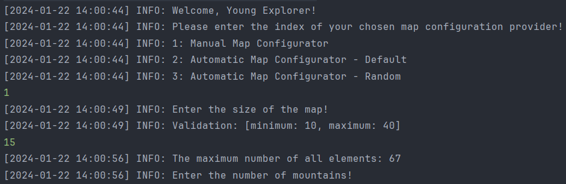
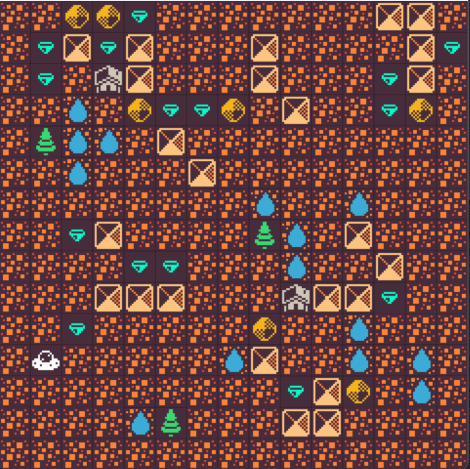

# [Mars Exploration](https://github.com/PinterOliver/mars-exploration)

Welcome to the Mars Exploration Project! Humanity's bright future includes the colonization of Mars, and this Java application aids in simulating Mars environments for exploration. Developed for educational purposes, the project focuses on applying SOLID and Object-Oriented Programming (OOP) principles.

## Overview

The Mars map is created based on a specified configuration, including resources, mountains, waters, and more. The application provides a simulated environment for exploration.

<details>
  <summary>Table of Contents</summary>
  <ol>
    <li><a href="#getting-started">Getting started</a></li>
    <li><a href="#configuration">Configuration</a></li>
    <li><a href="#usage">Usage</a></li>
    <li><a href="#contact">Contact</a></li>
  </ol>
</details>

## Getting Started

1. **Clone** the repository to your local machine:

    ```bash
    git clone https://github.com/PinterOliver/mars-exploration/
    ```

2. **Navigate** to the project directory:

    ```bash
    cd mars-exploration
    ```

3. **Build** the project:

    ```bash
    mvn clean package
    ```

## Configuration

### To configure the Mars map, follow these steps:

1. (Optional) Specify where the generated map txt should be saved. Change the path in the Application class by modifying the **FILE_PATH** variable.

2. **Run** the application in the console:

    ```bash
    java -cp .\target\mars-exploration-1-1.0-SNAPSHOT-jar-with-dependencies.jar com.codecool.marsexploration.Application
    ```

3. **Follow the prompts** to provide necessary information, such as the number of resources, mountains, waters, and other settings.
   
<br/>
   (Note: you can choose preconfigured options)

## Usage

Once configured, the application will generate a Mars map in a text file format. Explore the generated map through the JavaFX GUI, displayed after the configuration.
The result should look like this:
<br/>


## Contact

For inquiries or feedback, feel free to reach out to the developers:

### Developer 1

- **Name:** Pintér Olivér
- **Email:** pinter.oliver.peter@gmail.com
- **GitHub:** [PinterOliver](https://github.com/PinterOliver)

### Developer 2

- **Name:** Bonifert András
- **Email:** bonifert.andras@gmail.com
- **GitHub:** [Bonifert](https://github.com/Bonifert)

### Developer 3

- **Name:** Kozák Ádám
- **Email:** kar.adam.robert@gmail.com
- **GitHub:** [Kozakadam](https://github.com/Kozakadam)
